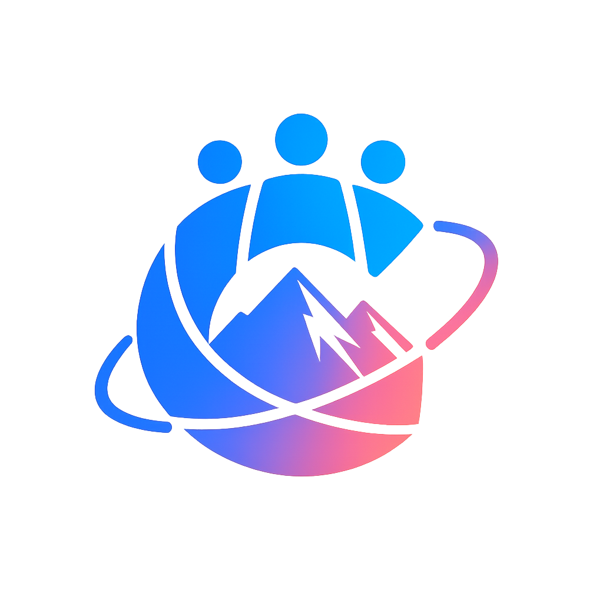

# 👥 **Groupeak team**

  
    

## 📑 Оглавление
- [👥 О нас](#-о-нас)
- [🎯 Наша цель](#-наша-цель)
- [👨‍👩‍👧‍👦 Наша команда](#-наша-команда)
- [🛠 Технологии и инструменты](#-технологии-и-инструменты)
- [📄 Лицензия](#-лицензия)
- [📞 Свяжитесь с нами](#-свяжитесь-с-нами)

## 🚀 О нас

*Мы — активная команда разработчиков, объединённых страстью к созданию современных мобильных приложений. 
Наш коллектив сочетает в себе разнообразные навыки и опыт, что позволяет нам эффективно решать задачи и воплощать инновационные идеи в жизнь. Мы стремимся к постоянному росту и совершенствованию, стараясь предлагать нашим клиентам качественные и надёжные решения.*

## 🎯 Наша цель

*Создавать эффективные и инновационные веб-решения, которые помогают нашим клиентам достигать их целей. 
Мы используем передовые технологии и лучшие практики разработки, чтобы обеспечивать высокое качество и надёжность наших продуктов.*

## 👨‍👩‍👧‍👦 Наша команда

### **Хачковский Юрий**
**Team Lead, Project Manager, Frontend Developer**  

*Юрий отвечает за все нововведения, фичи и идеи, ведёт проект и обеспечивает его развитие.*

**Основные обязанности**
- **Координация команды**
- **Оптимизация рабочих процессов**
- **Поддержка Frontend**

---

### **Батычков Вячеслав**
**Lead Backend Developer, DevOps Engineer**  

*Вячеслав отвечает за процесс производительности и масштабируемости приложения.*

**Основные обязанности:**
- **Проектирование и поддержка API, Базы данных**
- **Код-ревью и менторство**
- **Координацию бэкенд-части с фронтом**

---

### **Денис Комлев**
**Backend Developer, QA Engineer**  

*Денис обеспечивает надежный и безопасный продукт.*

**Основные обязанности:**
- **Создание серверных решений**
- **Тестирование приложения**

---

### **Долбин Матвей**
**Lead UX/UI Designer, Technical Writer**  

*Матвей сочетает в себе навыки написания технической документации и дизайна пользовательского интерфейса.* 

**Основные обязанности:**
- **Создание интерфейсов**
- **Написание технических отчетов**
- **Подготовка макетов для разработки**

---

### **Михаил Пристенский**
**Lead Frontend Developer**  

*Михаил является главным фронтенд-разработчиком команды.*

**Основные обязанности:**
- **Архитектура интерфейсов**
- **Внедрение современных технологий**

---

### **Виталий Петренко**
**UX/UI Designer, Frontend Developer**  

*Виталий обладает обширными знаниями в области графического дизайна и дизайна сайтов.*

**Основные обязанности:**
- **Создание визуального дизайна**
- **Создание и поддержка дизайн-системы**

## 🛠 Технологии и инструменты

*Мы используем широкий спектр технологий и инструментов для обеспечения качественной разработки:*

### **Mobile (Android):**
- 
- 

### **Backend:**
- 
- 

### **UX/UI Дизайн:**
- 
- 
- 

### **DevOps:**
- 
- 
- 

### **База данных:**
- 

## 📞 Свяжитесь с нами

*Если у вас есть вопросы или предложения, не стесняйтесь обращаться!*

